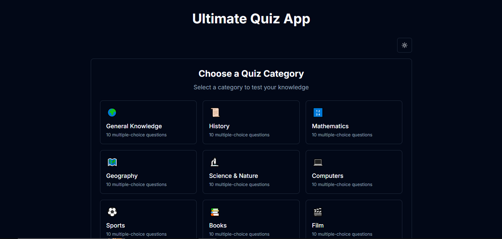
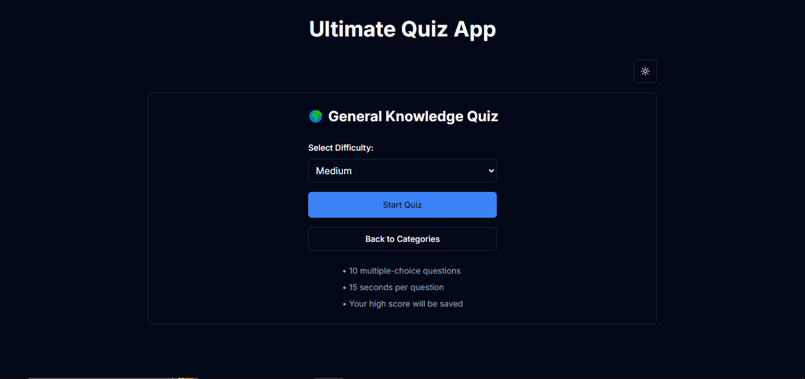
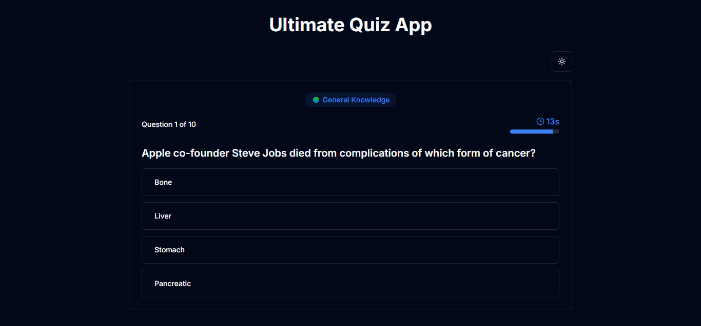
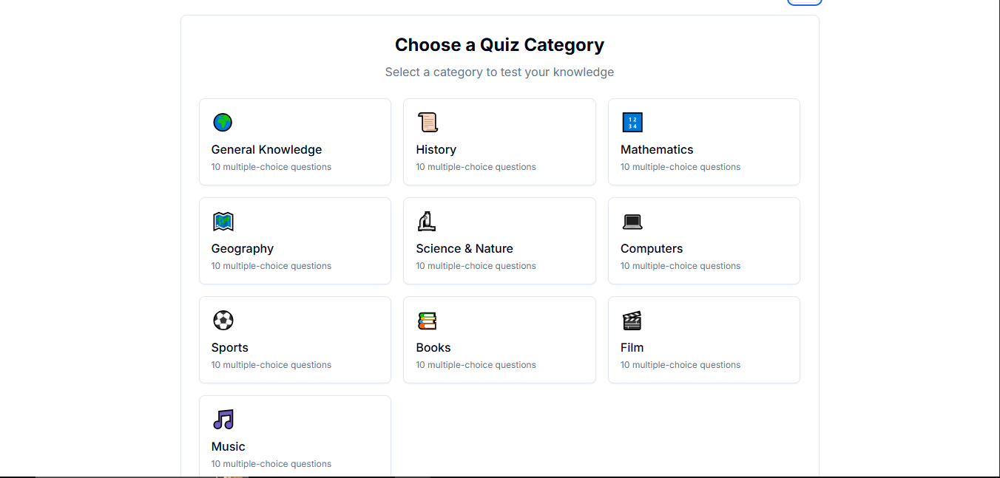

# Enhanced Quiz App with Multiple Categories

🚀 **Live Demo**: [Ultimate Quiz App](https://v0-online-quiz-app.vercel.app/)   

## 🚀 New Features Added

✅ **Multiple Quiz Categories**: Added 10 different quiz categories including:

- General Knowledge 🌍  
- History 📜  
- Mathematics 🔢  
- Geography 🗺️  
- Science & Nature 🔬  
- Computers 💻  
- Sports ⚽  
- Books 📚  
- Film 🎬  
- Music 🎵  

✅ **Category Dashboard**: Created a new home screen with a grid of category cards to choose from  

✅ **Category-specific High Scores**: The app now tracks and displays high scores for each category separately  

✅ **Enhanced Navigation**: Added the ability to go back to categories from the quiz setup or results screen  

✅ **Visual Indicators**: Each category has its own icon and is displayed during the quiz  

## 🎮 How It Works

1. **Category Selection**: Users start by selecting a quiz category from the dashboard  
2. **Quiz Setup**: After selecting a category, users can choose difficulty and start the quiz  
3. **Quiz Flow**: Same as before, with questions specific to the selected category  
4. **Results Screen**: Shows category-specific results and high scores  
5. **Navigation Options**: Users can try the same category again or go back to the category selection  

## 🛠️ Technical Improvements

- **Persistent Storage**: High scores are now stored in a structured object in localStorage, organized by category ID  
- **Dynamic API Calls**: The app fetches questions based on the selected category ID  
- **Responsive Grid Layout**: The category selection screen uses a responsive grid that adapts to different screen sizes  
- **Enhanced UI**: Added category icons and visual indicators throughout the quiz experience  

## 📸 Screenshots

  
*Category selection screen with multiple quiz categories in dark mode*  

  
*Live quiz interface with selected category title and icon*  

  
*Category-specific results and high scores*  

  
*Category selection screen with multiple quiz categories in day mode*


## 🛠️ Installation & Setup

1. Clone this repository:  
   ```sh
   git clone https://github.com/your-username/quiz-app.git
   cd quiz-app

2. Install dependencies:
    # npm install

3. Start the development server:
    # npm run dev
    
